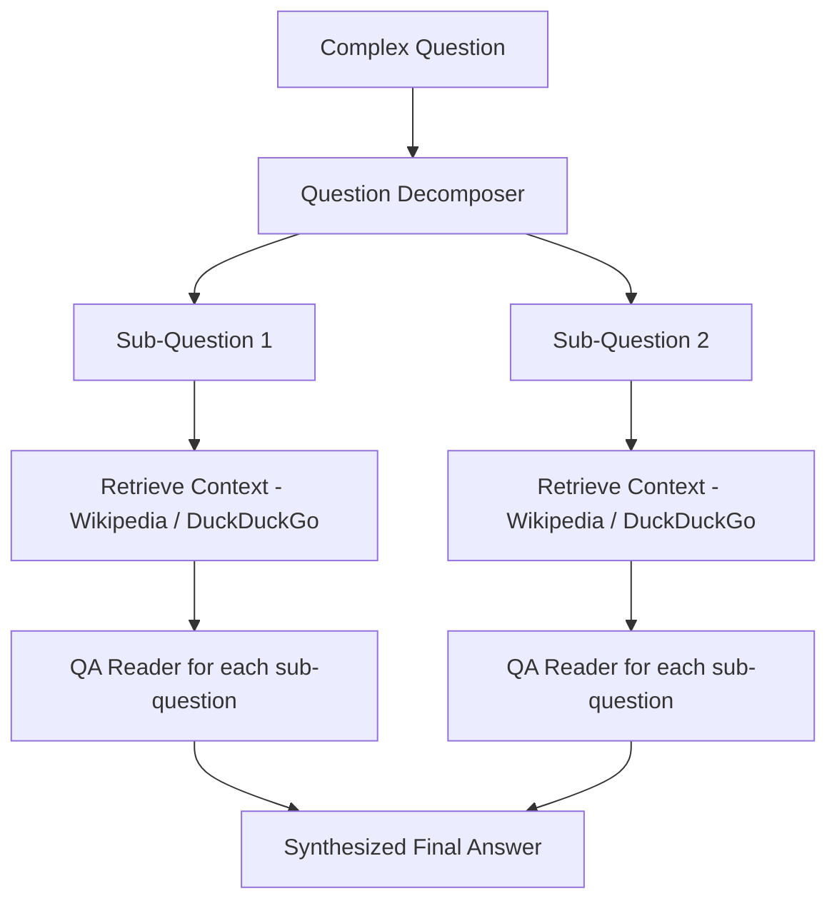

# Multi-Hop Question Answering 

## Overview

The **Multi-Hop QA Project** is a system designed to answer complex questions that require reasoning across multiple pieces of information. It **decomposes a question into simpler sub-questions**, retrieves relevant context from sources like Wikipedia or DuckDuckGo, and **synthesizes the answers** to provide a coherent final response. This demonstrates **multi-hop reasoning**, making it ideal for advanced QA tasks, research, and educational purposes.  

---

## How it Works

The project follows a **multi-hop reasoning pipeline**:



**Step-by-step process**:  
1. **Decomposition**: Split a complex question into simpler sub-questions.  
2. **Context Retrieval**: Fetch relevant information for each sub-question.  
3. **Answer Sub-Questions**: Use a QA model to answer each sub-question.  
4. **Synthesize**: Combine sub-question answers to form the final coherent answer.  

---

## Files and Structure

- `train_decomposer.py` — Fine-tune a T5 model to decompose a question into `(q1, q2)`.  
- `decompose_infer.py` — Load the trained decomposer to predict `q1` and `q2` for new questions.  
- `qa_pipeline.py` — Retrieve context (DuckDuckGo / Wikipedia) and run a QA reader to answer sub-questions.  
- `evaluate.py` — Compute metrics for decomposition accuracy and final answer performance.  
- `run_demo.py` — Small end-to-end demo using the first N examples (requires internet).  
- `requirements.txt` — Python dependencies.  

**Dataset format (`cc.tsv`)**:  
- Columns: `Question`, `Q1`, `Q2`, `Answer`

QUESTION: What is the capital of the birthplace of Rumi?

Q1: What is the birthplace (country only) of Rumi?

Q2: What is the capital of #1?

Answer: ['Afghanistan']

---

## Installation

1. Clone the repository:
```bash
git clone https://github.com/Suparna62/multi_hop_qa_project.git
cd multi_hop_qa_project
```

3. Create a virtual environment and install dependencies:
```
python -m venv venv
source venv/bin/activate       # or venv\Scripts\activate on Windows
pip install -r requirements.txt
```

## Usage

1. Train Decomposer (optional, requires GPU for speed)
```
   python train_decomposer.py --train-file cc.tsv --output_dir decomposer_t5
```
3. Run Demo (end-to-end, uses web search)
```
python run_demo.py --dataset dataset/cc.tsv --n 10
```
5. Evaluate Model
```
python evaluate.py --dataset dataset/cc.tsv --model decomposer_t5 --n 10
